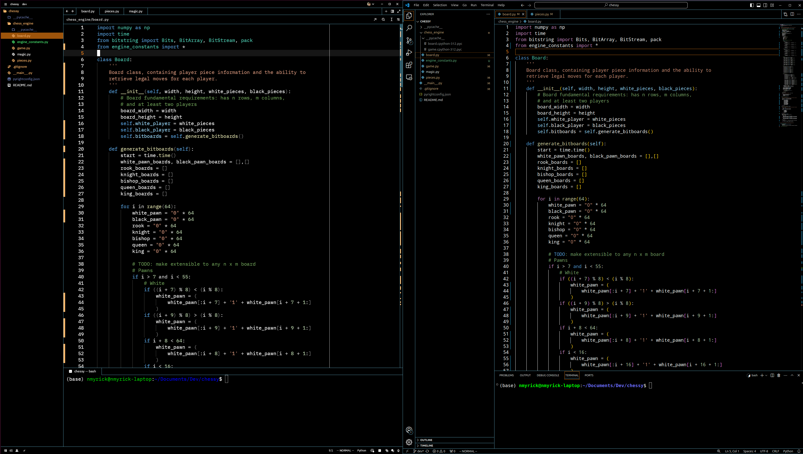

    <h3 align="center">VSCode Dark High Contrast for <a href="https://zed.dev/">Zed</a></h3>

## Preview

## Comparison to VSCode

### How to Install Through Zed (Not available yet):
1. Open Zed
2. `cmd+shift+p` and select *zed: extensions*
3. Search for *VSCode Dark High Contrast* and install the extension.
4. Press enter or find in 'cmd+shift+p'$\rightarrow$*theme selector: toggle*.

### How to Install Manually:
1. Download [vscodehighcontrast.json](./themes/vscodehighcontrast.json).
2. Place into `~/.config/zed/themes/` directory.
